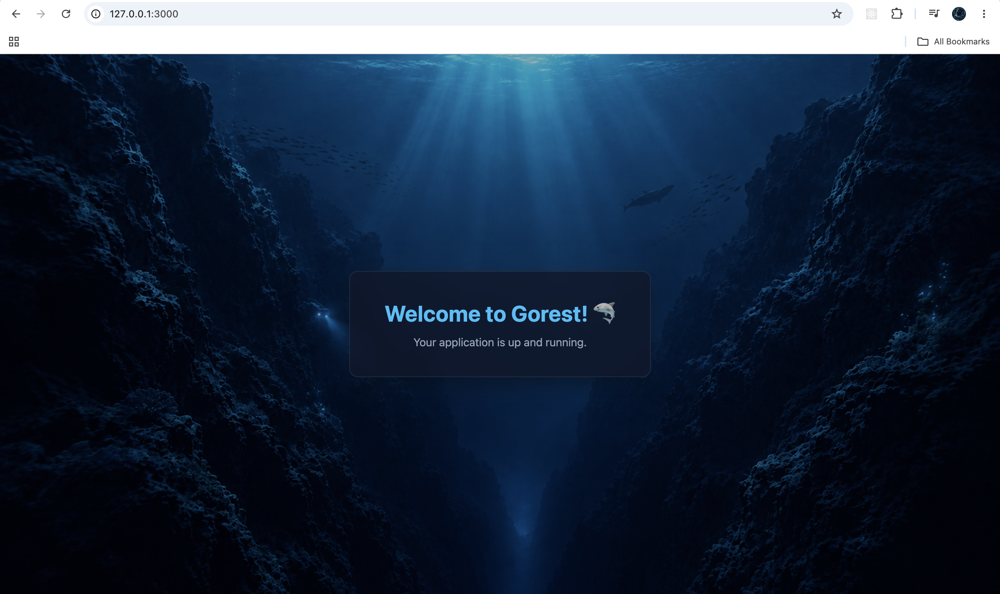

# GOREST

An opinionated Go application framework for building websites, REST APIs, and backend services.

GOREST provides a structured application foundation with integrated infrastructure for HTTP servers, configuration, logging, databases, Redis, migrations, seeders, and data access.

Its goal is simple: reduce repetitive infrastructure work, establish consistent application conventions, and help development teams focus on business functionality without giving up control of Go.

---

## ⚙️ Requirements

GOREST requires **Go 1.23** or higher.

Additional requirements depend on the components used by your application.

If you need to install or upgrade Go, visit the [official Go download page](https://go.dev/dl/).

### Supported Databases
GOREST provides modular support for:
- PostgreSQL
- MySQL
- SQL Server
- Oracle
- SQLite
- MongoDB
- ScyllaDB

---

## 💡 Why GOREST?
Go gives developers a simple language, strong performance, and a flexible ecosystem.

That flexibility is valuable, but building a production backend still requires decisions about application structure, routing, configuration, logging, database access, migrations, caching, and application lifecycle.

Without a common foundation, different applications can gradually adopt different structures and conventions:
- **Project A** → Router A + ORM A + Migration A
- **Project B** → Router B + ORM B + Migration B
- **Project C** → Custom structure + Custom conventions

This is not necessarily a problem for a single project. At team or organizational scale, however, architectural differences can make applications harder to understand, maintain, and transfer between developers.

GOREST takes an opinionated approach.

It provides a common application foundation and a set of conventions for recurring backend infrastructure, while keeping application and business logic under the developer's control.

The objective is not to replace Go or hide its ecosystem.

**GOREST provides structure around Go, not a replacement for Go.**

---

### Focus on Business Logic
GOREST handles common application infrastructure so developers can spend more time implementing application-specific requirements.

Depending on the application, GOREST provides:
- HTTP server and routing integration
- Centralized application bootstrapping
- Configuration management
- Structured logging
- Redis integration
- Database connection management
- Database migrations and seeders
- Native SQL and ORM-based data access
- REST API and Web view support
- Application lifecycle management

The application remains regular Go code. Developers can still use Go's standard library and other packages when a requirement falls outside GOREST's abstractions.

---

## 🛠️ What GOREST Provides

### Opinionated Application Structure
GOREST provides a consistent application structure and conventions for organizing backend applications.

A common structure can help teams:
- onboard new developers faster
- make projects easier to navigate
- reduce architectural differences between applications
- make knowledge easier to transfer between team members
- reduce dependency on individual developers

The goal is not to enforce every implementation detail.

The goal is to establish a predictable foundation for the parts of an application that are commonly repeated.

---

### Fail-Fast Configuration
GOREST validates important application and database configuration during initialization and query construction where applicable.

The intention is to detect invalid configuration and query-related problems as early as possible instead of allowing invalid state to propagate deeper into application execution.

---

### Native SQL and ORM
GOREST supports both Native SQL and ORM-based data access.
Use Native SQL when you need:
* direct control over SQL
* database-specific capabilities
* complex queries
* predictable SQL behavior
* minimal abstraction

Use the ORM when you need:

* structured model mapping
* query building
* relationships
* preloading
* filtering
* ordering
* pagination
* parameter binding

This allows developers to choose the appropriate abstraction level for each use case instead of forcing every query through a single approach.

---

### Integrated Application Lifecycle
GOREST provides a centralized application lifecycle for initializing infrastructure and starting the application.

```text
Install
    ↓
Configuration
    ↓
Logging
    ↓
Database / Redis
    ↓
HTTP Server
    ↓
Application
```

The specific components used depend on the module you need.

---

## 📁 Features

### 1. Application Lifecycle & Engine
- **Application Lifecycle** — Provides a structured lifecycle for application initialization and startup.
- **Thread-Safe Initialization** — Protects critical initialization paths from concurrent execution.
- **Global Timezone Synchronization** — Keeps application modules aligned with the configured application timezone.
- **Startup Timeout** — Uses a startup context timeout to prevent initialization from waiting indefinitely on slow external dependencies.

### 2. Integrated Infrastructure
- **Centralized Bootstrapping** — Provides a consistent initialization process for application infrastructure.
- **HTTP Server Integration** — Supports integrating HTTP servers and routing into the application lifecycle.
- **Redis Integration** — Provides Redis connectivity for caching, sessions, and key-value operations.
- **Database Integration** — Provides centralized database configuration and connection management.
- **Structured Logging** — Provides a common logging foundation across application components.
- **Multi-Database Support** — Supports both SQL and NoSQL database environments through modular database adapters.

### 3. Migrations & Seeders
- **Database Migrations** — Provides controlled schema migration workflows.
- **Database Seeders** — Supports inserting initial or development data through application-managed seeders.
- **Driver-Specific Migrations** — Allows migration workflows to follow the capabilities and requirements of the target database.

### 4. Data Access
GOREST provides two complementary approaches to database access:

#### Native SQL
For cases where developers need direct control over SQL and database-specific behavior.

#### ORM
For structured data access involving models, relationships, query building, preloading, pagination, filtering, ordering, and parameter binding.

The ORM also provides validation intended to make query behavior more explicit and predictable.

The ORM is designed with explicit validation and predictable behavior rather than silently guessing application relationships or query intent.

#### ORM Reliability Features
- **Explicit Relationship Configuration** — Relationships can require explicit metadata so relationship configuration errors can be detected rather than silently inferred.
- **Pluralization Support** — Supports common and irregular pluralization rules when mapping models to database tables.
- **Exact Column Matching** — Uses exact column and alias matching when validating selected columns.
- **SQL-Aware Parameter Parsing** — Handles placeholders while accounting for SQL string literals, comments, and PostgreSQL dollar-quoted sections.
- **Strict Parameter Binding** — Validates placeholder and argument alignment before query execution.

---

## Application Philosophy
GOREST follows a few simple principles:

<ol>
  <li>Keep application structure predictable.</li>
  <li>Fail early when configuration or query intent is invalid.</li>
  <li>Prefer explicit behavior over silent guessing.</li>
  <li>Provide abstraction without taking control away from developers.</li>
  <li>Allow Native SQL when abstraction is not appropriate.</li>
  <li>Keep recurring infrastructure concerns consistent across applications.</li>
  <li>Use Go as the foundation rather than hiding Go behind another programming model.</li>
</ol>

GOREST is designed to provide the foundation.

## ⚙️ Installation & Getting Started

To get started with **Gorest**, follow these simple steps to set up your local development environment.

### 1. Create new project
```bash
mkdir myapp
```

```bash
cd myapp
```

```bash
go mod init myapp
```

```bash
go get github.com/elsyahtech/gorest
```

---

### 2. Create `main.go`

Once you have installed Gorest, create a `main.go` file at the root of your project. 

Here is what the default `main.go` looks like:

```go
package main

import (
    "github.com/elsyahtech/gorest"
)

func main() {
	app := gorest.New()
	app.Start()
}
```

### 3. Run the application
```bash
go run main.go
```

Then open:
```bash
http://127.0.0.1:3000
```

Your application is now running.



## 🔧 Customize When You Need To

When you need to customize application settings, you can provide configuration is centralized inside gorest.New(...), giving you full code-level visibility without messing with complex, fragmented configuration XML files.

---

### 1. Application Core Configuration (gorest.Config)
```go
app := gorest.New(gorest.Config{
    // Application identifier, ideal for microservices architecture, service discovery, and tracing.
    AppName: "My App",

    // Version tag, commonly used for CI/CD pipelines, release tracking, and artifact management.
    Version: "1.0.0",

    // Operating environment mode (e.g., "development", "staging", "production").
    Environment: "development",

    // Global timezone synchronization to ensure consistent time parsing, logging, and timestamps.
    Timezone: "Asia/Jakarta",

    // Debug mode. When true, the HTTP server is bypassed and only the CLI/console runner executes,
    Debug: false,
})
```

- **AppName:** Identifies your service name. Crucial for microservice architectures, log tracing, and service meshes.
- **Version:** Tracks your deployment version, heavily integrated into CI/CD release tagging.
- **Environment:** Controls runtime behaviors (development, staging, production).
- **Timezone:** Enforces a unified system-wide timezone (Asia/Jakarta, UTC, etc.) to eliminate time drift across logs, database timestamps, and token expiration logic.
- **Debug:** When set to true, halts the HTTP server listener so developers can safely run local debugging, dry-run SQL migrations, or test data seeders via console.

---

### 2. Subsystem & Database Plug-and-Play (app.Use(...))
Gorest uses a clean middleware-like registration pattern via app.Use(...):

```go
app.Use(
    log.Run(log.ConfigDefault),
    redis.Run(redis.ConfigDefault),
    server.Run(server.ConfigDefault),
    database.Run(database.ConfigDefault),
)
```

- **Logger & Server:** Enabled by default (log.ConfigDefault, server.ConfigDefault) to instantly spin up routing and structured logging.
- **Redis and Database Drivers:** Easily switch your database backend by changing the Driver constant (database.Oracle, SQL Server, MYSQL, PostgreSQL, SQLite, MongoDB, ScyllaDB.). **Default Database:** GOREST uses **SQLite** as its default database driver. No external database server is required to run the default application.
- **Controlled Migrations & Seeders:** Toggle database.MigrationEnabled and database.SeederEnabled directly inside the config block to let Gorest handle schema bootstrapping automatically on boot.

See [configuration detail](./docs/CONFIGURATION.md)

---

### 3. Server & Router (app.Use(...))

```go
routers := []server.RouterRegistrar{
    UserRoutes,
    ProductRoutes,
    // Add more modular route registrars here effortlessly.
}
app.RegisterServices(routers)
```

See server & router configuration detail: [Router Technical Guide](./docs/guide/router.md)

---

# 🔧 Configuration
Read the full configuration breakdown: [Configuration Documentation](./docs/CONFIGURATION.md)

---

# 📚 Guides
Read the full guide: [Guide Documentation](./docs/GUIDE.md)

# 🔧 Troubleshoot
Read the full troubleshoot guide: [Troubleshoot Documentation](./docs/GUIDE.md)