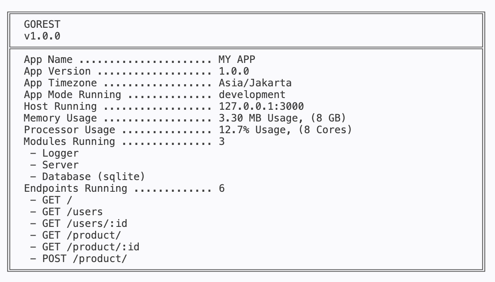

## 1. Logger Guide
Gorest integrated with Zap Logger as a core logger.

* **Overview:** A high-performance, built-in logging system designed to give you absolute operational visibility without sacrificing speed. 
* **Key Benefits:** Zero-allocation philosophy, strict structured logging, and automated log file rotation out-of-the-box. Every operational action (server startup, database migrations, security warnings) is safely tracked.
* **Sample Output Preview:**
```text
{"level":"info","timestamp":"2026-10-06T22:44:31.036+0700","message":"starting gorest","service":"My App"}
{"level":"info","timestamp":"2026-10-06T22:44:31.036+0700","message":"starting server","service":"My App"}
{"level":"info","timestamp":"2026-10-06T22:44:31.138+0700","message":"Endpoints running ['GET /', 'GET /users', 'GET /users/:id', 'GET /product/', 'GET /product/:id', 'POST /product/']","service":"My App"}
{"level":"info","timestamp":"2026-10-06T22:44:31.138+0700","message":"server started successfully","service":"My App"}
{"level":"info","timestamp":"2026-10-06T22:44:31.138+0700","message":"gorest is running","service":"My App"}
```
Read the full logger technical breakdown: [Logger Technical Guide](./guide/logger.md)

---

## 2. Server & Router Guide

* **Overview:** Built on top of the lightning-fast Fiber HTTP engine, Gorest provides an intuitive, robust routing and middleware ecosystem.
* **Key Benefits:** Blazing-fast request context handling, clean modular route grouping, built-in security middlewares (OAuth, CORS, Recovery), and seamless ecosystem integration.
* **Sample Output Preview:**



Read the full Server & Router technical breakdown: [Router Technical Guide](./guide/router.md)

---

## 3. Database, ORM & Querying Guide
* **Overview:** The crown jewel of Gorest. A multi-driver data persistence layer featuring auto-migrations, smart seed protection, and a custom reflection-powered ORM.
* **Key Benefits:** Supports 7+ database drivers (SQL & NoSQL: MySQL, Postgres, MSSQL, Oracle, SQLite, MongoDB, ScyllaDB). Features custom gorest struct tags, automated Preload (1:1, 1:N, M:N), and full fallback support for Native Queries when maximum optimization is required.
* **Sample Output Preview:**

Read the full Database technical breakdown: [Router Technical Guide](./guide/router.md)

---

## 4. Database Migration & Seeder

### How to Run Migration:

By default, migrations and seeders can be triggered automatically upon application startup by simply setting `Migration: true` and `Seeder: true` inside your database configuration block in `main.go`:
```go
database.Run(database.Config{
     Driver:    database.SQLITE,
     Name:      "default_gorest",
     Migration: true, // Set to true to auto-run migrations on boot
     Seeder:    true, // Set to true to auto-run seeders on boot
})
```

> 🛡️ **Smart Engine Protection (No Overwrite Worries):**
> You don't need to worry about accidentally wiping your production or development data if you leave migration or seeder flags enabled (`true`) by accident:
> * **For Migrations:** Gorest is smart enough to check table existence. If a table does not exist, it will automatically generate it. If the table already exists, Gorest safely ignores it.
> * **For Seeders:** Similarly, if a table has already been seeded previously, Gorest will automatically ignore subsequent seeding attempts even if the seeder flag remains active. Your existing data is 100% safe from being overwritten!

---

### Create Migration File:

Create a new directory in your project root with the structure shown below. You can adjust it based on the database driver you choose.

```text
./database/
├── migrations/
│   ├── mongo/
│   ├── mysql/
│   ├── oracle/
│   ├── postgres/
│   ├── scylla/
│   ├── sqlite/
│   └── sqlserver/
└── seeders/
    ├── mongo/
    ├── mysql/
    ├── oracle/
    ├── postgres/
    ├── scylla/
    ├── sqlite/
    └── sqlserver/
```

Create .sql, .cql, or .json files according to your chosen database driver inside each of those respective directories.

Read Schema Sample for migration and seeder needs [SQL Schema](./guide/database/schema.md)

---

## 5. Defining Entities & Struct

Gorest supports common and irregular pluralization rules when mapping models to database tables.

To map your Go structs seamlessly to database tables across any supported engine (SQL or NoSQL), Gorest introduces its very own custom **`gorest`** struct tag.

#### Example: The `User` Entity Struct (`./entities/user.go`)
```go
type User struct {
    ID           string      `gorest:"id, primary_key, object_id" json:"id"` 
    Email        string      `gorest:"email" json:"email"`
    Password     string      `gorest:"password" json:"password"`
    DepartmentID string      `gorest:"department_id" json:"departmentId"`
    IsActive     bool        `gorest:"is_active" json:"isActive"`
    IsDeleted    bool        `gorest:"is_deleted" json:"isDeleted"`
    CreatedAt    time.Time   `gorest:"created_at" json:"createdAt"`
    UpdatedAt    *time.Time  `gorest:"updated_at" json:"updatedAt"`
    DeletedAt    *time.Time  `gorest:"deleted_at" json:"deletedAt"`
    
    // Relation mapping example, if any
    Department   *Department `gorest:"-" references:"ID" json:"department,omitempty"`
}
```

--- 

## 6. Response Handling Guide

* **Overview:** True to Gorest's philosophy—“A lightweight, opinionated framework for building websites, REST APIs, and backend services”—response rendering is completely flexible.
* **Key Benefits:** Unified response format for lightning-fast REST JSON APIs, alongside built-in server-side rendering support for traditional HTML web applications and templates.
* **Sample Output Preview:**

```text
// JSON API vs Traditional HTML Rendering
return ctx.JSON(gorest.Map{"status": "success", "data": users})

// OR
return ctx.Render("templates/index", gorest.Map{"Title": "Welcome to Gorest"})
```

Read the full response handler technical breakdown: [Response Handler Guide](./guide/response/view_response.md)